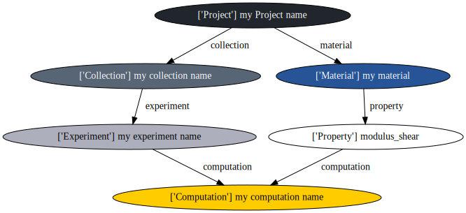

# CRIPT Graph Operation Plugin for the Python SDK

[](https://github.com/InnocentBug/cript_graph/actions/workflows/tests.yml)
[](https://github.com/InnocentBug/cript_graph/actions/workflows/trunk.yml)

This repository contains a plugin designed to work with the Python SDK of the CRIPT project. The CRIPT project is an innovative initiative in polymer technology. For more information about the project, please visit the [CRIPT website](https://criptapp.org/).

The Python SDK, which this plugin complements, can be found [here](https://github.com/C-Accel-CRIPT/Python-SDK). It provides a powerful set of tools for working with CRIPT data graphs.

## Installation

To install the CRIPT Graph Operation Plugin, you can use `pip`:

```shell
pip install cript-graph
```

## NetworkX Graph Conversion

The plugin offers a convenient conversion function to convert a CRIPT SDK data graph into a NetworkX graph. [NetworkX](https://networkx.org/) is a widely-used Python package for graph operations.

Here's an example of how to use the conversion function:

```python
import cript
import cript_graph

with cript.API(None, None) as api:
    # CRIPT SDK code to build or download the data graph
    project = cript.Project(...)
    # ...
    networkx_graph = cript_graph.get_networkx_graph(project)
    # Perform NetworkX graph operations
    print(networkx_graph.nodes)
    print(networkx_graph.edges)
```

Please refer to the documentation of the `get_networkx_graph` function for detailed information about the resulting graph.

## Graphviz Dot Visualization

Visualizing the entire data graph of CRIPT can sometimes be challenging, especially when more detailed information is required, such as for debugging purposes. In such cases, the Graphviz dot tool can be a valuable resource.

The plugin provides a tool to generate a visual representation of the data graph using the Graphviz dot language.

Here's an example of how to generate a dot file using the plugin:

```python
import cript
import cript_graph

with cript.API(None, None) as api:
    # CRIPT SDK code to build or download the data graph
    project = cript.Project(...)
    # ...
    # Create an intermediate NetworkX graph
    networkx_graph = cript_graph.get_networkx_graph(project)
    # Generate the graph representation in the dot language
    dot_string = cript_graph.get_dot_graph(networkx_graph)
```

You can write the resulting dot language string to a file:

```python
with open("graph.dot", "w") as file_handle:
    file_handle.write(dot_string)
```

To convert the dot file to an SVG graph using the Graphviz command line tool:

```shell
dot -Tsvg graph.dot > graph.svg
```

Alternatively, you can use the [pydot](https://github.com/pydot/pydot) package to handle the generation of the visualization from within Python:

```python
import pydot

pydot_graph = pydot.graph_from_dot_data(dot_string)
pydot_graph.write_svg("graph.svg")
```

An example graph of CRIPT visualized using Graphviz dot:



## References

[Walsh, D. J., Zou, W., Schneider, L., Mello, R., Deagen, M. E., Mysona, J., ... & Olsen, B. D. (2023). Community Resource for Innovation in Polymer Technology (CRIPT): A Scalable Polymer Material Data Structure.](https://pubs.acs.org/doi/full/10.1021/acscentsci.3c00011)
